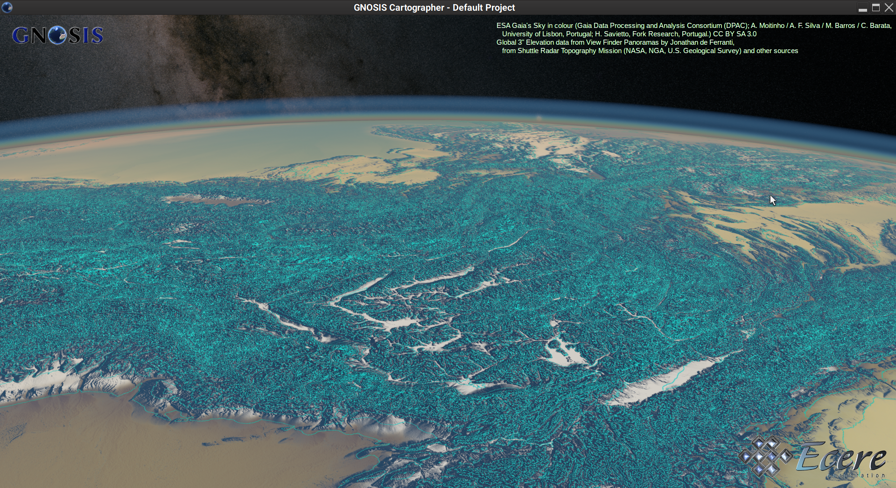
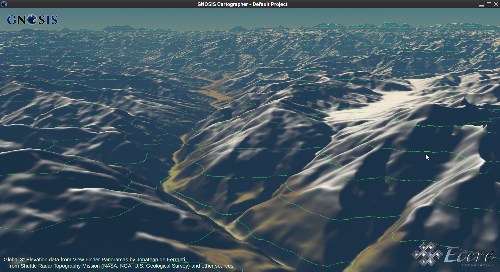
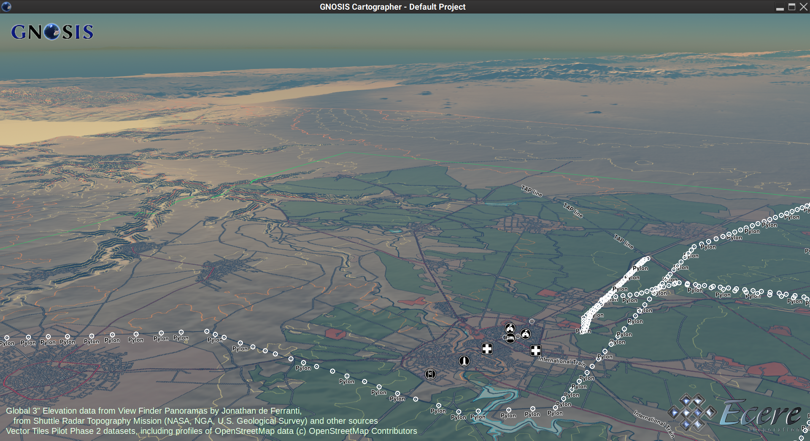

## Screenshots

This folder will hold screenshots of the implementations.

### Ecere's 3D client driving tile-based contours generation process on GNOSIS Map Server

#### Worldwide elevation contours at 500 meters (vector tiles)



#### Worldwide elevation contours at 500 meters in the Himalayas (vector tiles)



#### Daraa, Syria elevation contours at 250 and 50 meters (vector tiles)



#### Sample process execution

This process execution document instructs to render a map including contours, roads and a route.
The contours and route are computed on-the-fly using the _ElevationContours_ and _OSMEcereRoutingEngine_ processes (using Open Routing API).

```json
{
   "id" : "ContoursRoadsAndRouteMap",
   "process" : "https://maps.ecere.com/processes/RenderMap",
   "inputs" : [
      {
         "id" : "Contours250",
         "process" : "https://maps.ecere.com/processes/ElevationContours",
         "inputs" : [
            { "collection" : "https://maps.ecere.com/collections/vtp/Daraa2/Daraa_DTED" }
         ],
         "parameters" : { "distance" : 250 }
      },
      { "collection" : "https://maps.ecere.com/collections/vtp/Daraa2/TransportationGroundCrv" },
      {
         "id" : "MyRoute",
         "process" : "https://maps.ecere.com/processes/OSMEcereRoutingEngine",
         "inputs" : [
            { "collection" : "https://maps.ecere.com/collections/vtp/Daraa2/TransportationGroundCrv" }
         ],
         "parameters" :
         {
            "waypoints": {
               "type": "MultiPoint",
               "coordinates": [
                  [ 36.00210415, 32.54581061 ],
                  [ 36.11221587, 32.67020983 ]
               ]
            }
         }
      }
   ],
   "parameters" : { "style" : "night" }
}
```

Five ways this could be used:

- POST to {process} (e.g. /processes/RenderMap aka /map, or to /processes/ElevationContours) to retrieve output of process (e.g. GeoTIFF, GeoJSON, PNG). Sync or async. Optionally include BBOX, width & height.
- POST to {process}/tiles (e.g. /processes/RenderMap/tiles aka /map/tiles, or to /processes/ElevationContours/tiles) to retrieve tiles template and tileMatrixLink. If a {TileMatrixSetId} is included in the target resource URL, only get templates and links for that one TMS.
- POST to root /tiles (using process or collection(s) specified in JSON) to retrieve tiles template and tileMatrixSetLinks
- POST to /collections to create new _virtual collection_ (for most intents and purposes, same as normal collection)
- GET /collections/{collectionID}/sourceExecution to retrieve execution document from virtual collection
